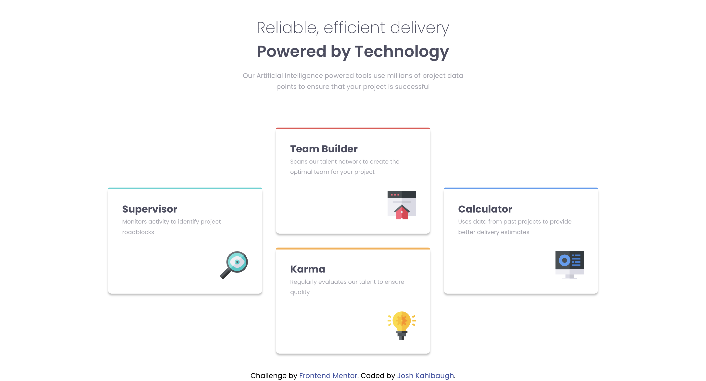

# Frontend Mentor - Four card feature section solution

This is a solution to the [Four card feature section challenge on Frontend Mentor](https://www.frontendmentor.io/challenges/four-card-feature-section-weK1eFYK). Frontend Mentor challenges help you improve your coding skills by building realistic projects. 

## Table of contents

- [Overview](#overview)
  - [The challenge](#the-challenge)
  - [Screenshot](#screenshot)
  - [Links](#links)
- [My process](#my-process)
  - [Built with](#built-with)
  - [What I learned](#what-i-learned)
  - [Continued development](#continued-development)
  - [Useful resources](#useful-resources)
- [Author](#author)

**Note: Delete this note and update the table of contents based on what sections you keep.**

## Overview

### The challenge

Users should be able to:

- View the optimal layout for the site depending on their device's screen size

### Screenshot



### Links

- Solution URL: [Solution](https://github.com/Joshk7/four-card-feature-section)
- Live Site URL: [Live Site](https://four-card-feature-section-omega-puce.vercel.app/)

## My process

I went with a mobile first approach to style the cards and heading. At first, I used flexbox for the main layout but ran into trouble with the second and third cards sticking together in the same div. Instead, I got rid of the extra div and used CSS grid for the solution which was much easier and allowed me to specify where the middle cards should go for different screen sizes.

### Built with

- Semantic HTML5 markup
- CSS custom properties
- Flexbox
- CSS Grid
- Mobile-first workflow

### What I learned

I learned a lot about CSS grid in order to solve this challenge. The more complex layout was much simpler than I thought it would be. 

I just put it all into a media query and specified where the cards should go:

```css
@media screen and (min-width: 1100px) {
    .card-container {
        grid-template: repeat(4, 1fr) / repeat(3, 1fr);
    }

    .cyan-card {
        grid-area: 2 / 1 / 4 / 2
    }

    .red-card {
        grid-area: 1 / 2 / 3 / 2
    }

    .orange-card {
        grid-area: 3 / 2 / 5 / 2
    }

    .blue-card {
        grid-area: 2 / 3 / 4 / 4;
    }
}
```

Other than that, I used flexbox to style the cards themselves:

```css
@media screen and (min-width: 700px) {
    .card-container {
        grid-template-columns: 1fr 1fr;
    }
}
```

I had already worked with flexbox previously, so that's why I went into this challenge with flexbox, but now I realize that grid might be better for more complex layouts.

### Continued development

I could possibly refine the breakpoints a little more so that cards aren't smooshed together at certain screen sizes. However, I'm pretty happy with how it all turned out.

### Useful resources

- [Grid Garden](https://cssgridgarden.com/) - This game really helped me practice using CSS grid before using it to solve this challenge.
- [An Interactive Guide to CSS Grid](https://www.joshwcomeau.com/css/interactive-guide-to-grid/) - Josh Comeau is an incredibly gifted developer who wrote this blog article about css grid and has an article on flexbox as well.

## Author

- Website - [Josh Kahlbaugh](https://joshuakahlbaugh.pages.dev/)
- Frontend Mentor - [@JoshK](https://www.frontendmentor.io/profile/Joshk7)
